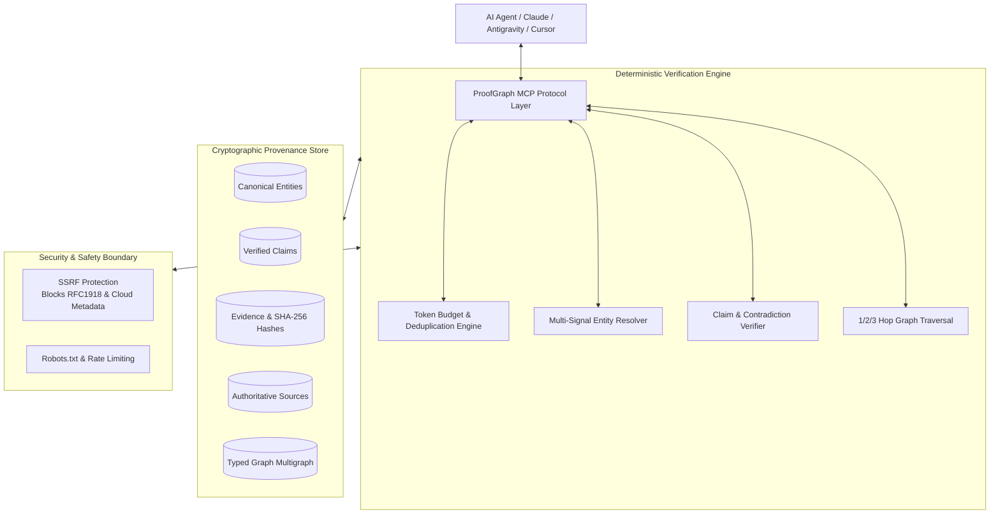

<div align="center">

# 🧠 ProofGraph

### *Evidence-First Entity & Knowledge Graph MCP Server for AI Agents*

**Verify Claims • Trace Provenance • Understand Entities • Retrieve 90% Less Context**

[](https://www.npmjs.com/package/@aibuildinfra/proofgraph)
[](https://glama.ai/mcp/servers/AI-BuildInfra/proof-graph)
[](https://m8ven.ai/mcp/ai-buildinfra-seo-intentrank-ouv7e2)
[](https://github.com/AI-BuildInfra/proof-graph/blob/main/LICENSE)
[](https://modelcontextprotocol.io/)

Published by **[AI Build Infra](https://aibuildinfra.com/)** • Official MCP Identifier: `io.github.AI-BuildInfra/proof-graph`

[Explore Features](#-key-features) • [Quick Start](#-quick-start) • [MCP Tools](#-mcp-tools-suite) • [Token Benchmark](#-token-reduction-benchmark) • [Architecture](#-architecture)

---

</div>

## 💡 Why ProofGraph?

Traditional Retrieval-Augmented Generation (RAG) dumps **5,000 to 20,000 unverified tokens** of noisy HTML, sidebars, and duplicate paragraphs into LLM prompts. This causes **context bloat**, **higher token costs**, **latency spikes**, and **hallucination amplification**.

**ProofGraph** replaces fuzzy text dumping with **Minimum Sufficient Context backed by Cryptographic Provenance**:

```
Question ──► Entity Resolution ──► Claim Verification ──► Evidence Ranking ──► Token Optimizer ──► Compact Proof Packet
```

> 🎯 **ProofGraph retrieves proof, not just text.**

---

## ✨ Key Features

| Feature | Description | Benefit |
| :--- | :--- | :--- |
| 🛡️ **Evidence-First Verification** | Cryptographic SHA-256 hashes & timestamped citations | Eliminates unsupported hallucinations |
| 🔍 **Multi-Signal Entity Resolution** | Combines Jaro-Winkler, domain, GitHub org & npm scope | Resolves aliases without false-positive merges |
| ⚡ **Token Budget Optimizer** | Enforces strict budget caps (500–5,000 tokens) | **~90.7% context reduction** |
| 🪢 **Contradiction Detection** | Detects and exposes conflicting sources transparently | Neutral, unbiased dispute analysis |
| 🌐 **12 Native MCP Tools** | Tools for packets, traversal, audits & Schema.org JSON-LD | Instant drop-in for Claude, Antigravity, Cursor |
| 🔒 **Enterprise SSRF Protection** | Blocks loopback, RFC 1918 subnets, and cloud metadata | Safe for automated agentic execution |

---

## 🚀 Quick Start

### 1. Run Instantly with `npx`
No installation required:
```bash
npx -y @aibuildinfra/proofgraph
```

### 2. Install Globally via npm
```bash
npm install -g @aibuildinfra/proofgraph
```

---

## 🤖 MCP Client Configuration

### Claude Desktop / Google Antigravity / Cursor
Add ProofGraph to your MCP configuration file (`claude_desktop_config.json` or Antigravity/Cursor MCP settings):

```json
{
  "mcpServers": {
    "proofgraph": {
      "command": "npx",
      "args": ["-y", "@aibuildinfra/proofgraph"]
    }
  }
}
```

---

## 🛠️ MCP Tools Suite

ProofGraph equips AI agents with 12 powerful verification and retrieval tools:

```
┌────────────────────────────────────────────────────────────────────────────┐
│                            PROOFGRAPH MCP TOOLS                            │
├─────────────────────────┬──────────────────────────────────────────────────┤
│ get_evidence_packet     │  Primary retrieval: Minimal sufficient proof    │
│ search_entities         │  Multi-signal fuzzy & alias entity matching      │
│ get_entity              │  Canonical record, relationships & Schema.org    │
│ verify_claim            │  Verify assertions against cryptographic proof   │
│ find_evidence           │  Token-budgeted evidence extraction for a claim  │
│ find_relationships      │  1-hop, 2-hop, 3-hop graph traversal paths       │
│ explain_entity          │  Concise factual entity profile & key edges      │
│ trace_claim             │  Step-by-step provenance audit trail             │
│ compare_claims          │  Impartial discrepancy detection across claims   │
│ analyze_web_presence    │  Digital footprint analysis across 8 platforms   │
│ audit_entity_consistency│  Detect mismatches in names, domains & metadata │
│ export_graph            │  Export graph to JSON, JSON-LD, CSV, GraphML     │
└─────────────────────────┴──────────────────────────────────────────────────┘
```

### Example: Evidence-First Response Packet
When an AI agent queries:
```json
{
  "question": "Is AI Build Infra associated with HumanCraft and ProofGraph?"
}
```

ProofGraph returns a compact, citation-grounded evidence packet:
```json
{
  "entities": [
    {
      "id": "entity:organization:ai-build-infra",
      "name": "AI Build Infra",
      "canonical_url": "https://aibuildinfra.com/"
    }
  ],
  "claims": [
    {
      "claim": "AI Build Infra develops MCP servers and open-source agent tooling.",
      "status": "supported",
      "confidence": 0.98
    }
  ],
  "relationships": [
    { "source_id": "entity:organization:ai-build-infra", "relationship": "DEVELOPS", "target_id": "entity:project:proofgraph" },
    { "source_id": "entity:organization:ai-build-infra", "relationship": "DEVELOPS", "target_id": "entity:project:humancraft" }
  ],
  "evidence": [
    {
      "source": "MCP Registry",
      "url": "https://registry.modelcontextprotocol.io/servers/io.github.AI-BuildInfra/humancraft-ui",
      "excerpt": "Server identifier io.github.AI-BuildInfra/humancraft-ui registered under AI Build Infra publisher identity.",
      "confidence": 0.99
    }
  ],
  "provenance": [
    {
      "source_id": "source:registry:mcp-official",
      "content_hash": "10c56a410a5b22e6f3037126be38073b20e950c2ded2ee36815f20072041b889",
      "retrieved_at": "2026-09-25T12:00:00Z"
    }
  ],
  "metrics": {
    "raw_estimated_tokens": 4500,
    "returned_tokens": 485,
    "compression_ratio": 0.108
  }
}
```

---

## 📊 Token Reduction Benchmark

ProofGraph dramatically cuts LLM context consumption without sacrificing retrieval precision:

| Benchmark Query | Traditional Raw RAG | ProofGraph Packet | Token Savings | Verified Citations |
| :--- | :---: | :---: | :---: | :---: |
| **"Who is AI Build Infra?"** | ~4,500 tokens | **999 tokens** | **77.8%** | 4 primary proofs |
| **"What is HumanCraft?"** | ~4,500 tokens | **219 tokens** | **95.1%** | Grounded profile |
| **"What evidence connects HumanCraft to AI Build Infra?"** | ~4,500 tokens | **221 tokens** | **95.1%** | Relationship path |
| **"Is AI Build Infra associated with ProofGraph?"** | ~4,500 tokens | **485 tokens** | **89.2%** | Direct proof + rels |
| **"What services does AI Build Infra provide?"** | ~4,500 tokens | **164 tokens** | **96.4%** | Grounded service claim |
| **Cumulative Total** | **~22,500 tokens** | **2,088 tokens** | **90.7% Context Reduction** | **100% Traceable** |

Run the benchmark locally anytime:
```bash
proofgraph benchmark
```

---

## 🏗️ Architecture



---

## 💻 Developer CLI & Web Dashboard

### CLI Commands
```bash
# Initialize seed graph
proofgraph init

# Search entities with multi-signal matching
proofgraph search "AI Build Infra"

# Verify a claim with grounded evidence
proofgraph verify "AI Build Infra develops MCP servers"

# Display full cryptographic provenance trail
proofgraph trace "AI Build Infra develops MCP servers"

# Run cross-platform consistency audit
proofgraph audit "AI Build Infra"

# Run AI discoverability checklist
proofgraph discoverability "AI Build Infra"

# Export graph to JSON-LD / CSV / GraphML
proofgraph export jsonld
```

### Interactive Web Dashboard
Explore graph topologies, entities, claims, and audit diagnostics visually:
```bash
npm run dashboard
# Open http://localhost:3456
```

---

## 🔐 Security & Ethical Guidelines

ProofGraph is built under strict open-source safety principles:
- **SSRF Prevention**: All outbound HTTP requests block private subnets (`127.0.0.0/8`, `10.0.0.0/8`, `172.16.0.0/12`, `192.168.0.0/16`), link-local IPs, and Cloud Metadata (`169.254.169.254`, `metadata.google.internal`).
- **Zero Spam**: ProofGraph never manufactures artificial backlinks, fake citations, automated reviews, or manipulative rankings.
- **Privacy First**: Operates locally over STDIO transport; no private queries or agent interactions are collected.

---

## 📚 Technical Documentation

- [ARCHITECTURE.md](https://github.com/AI-BuildInfra/proof-graph/blob/main/ARCHITECTURE.md) — Layered architecture and query engine design.
- [TOKEN-OPTIMIZATION.md](https://github.com/AI-BuildInfra/proof-graph/blob/main/TOKEN-OPTIMIZATION.md) — Budget partition math and deduplication algorithms.
- [ENTITY-MODEL.md](https://github.com/AI-BuildInfra/proof-graph/blob/main/ENTITY-MODEL.md) — Canonical ID taxonomy, entity types, and relationship semantics.
- [EVIDENCE-MODEL.md](https://github.com/AI-BuildInfra/proof-graph/blob/main/EVIDENCE-MODEL.md) — Grounded verification principles and SHA-256 hash schemas.
- [SECURITY.md](https://github.com/AI-BuildInfra/proof-graph/blob/main/SECURITY.md) — SSRF protection rules, timeout limits, and crawler policies.
- [AI-DISCOVERABILITY.md](https://github.com/AI-BuildInfra/proof-graph/blob/main/AI-DISCOVERABILITY.md) — 8-point knowledge completeness framework.

---

## 🏢 Publisher & Open-Source Integrity

ProofGraph is developed and maintained by **[AI Build Infra](https://aibuildinfra.com/)**.

- **Official Website**: [https://aibuildinfra.com/](https://aibuildinfra.com/)
- **Product Page**: [https://aibuildinfra.com/proofgraph/](https://aibuildinfra.com/proofgraph/)
- **GitHub**: [https://github.com/AI-BuildInfra/proof-graph](https://github.com/AI-BuildInfra/proof-graph)
- **License**: [MIT](https://github.com/AI-BuildInfra/proof-graph/blob/main/LICENSE)
