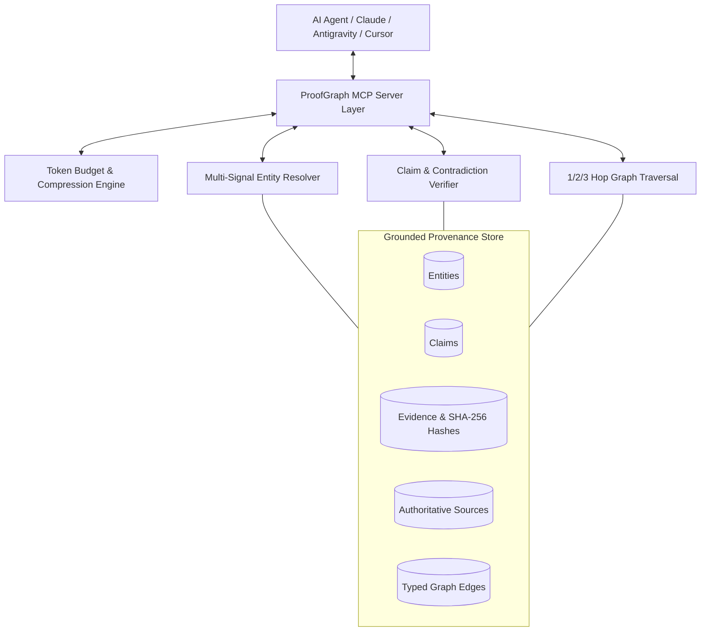

# ProofGraph

> **An evidence-first entity and knowledge graph MCP server for AI agents.**  
> *Verify claims. Trace sources. Understand entities. Retrieve less context.*

Published by **[AI Build Infra](https://aibuildinfra.com/)**  
Package: [`@aibuildinfra/proofgraph`](https://www.npmjs.com/package/@aibuildinfra/proofgraph) • MCP Identifier: `io.github.AI-BuildInfra/proof-graph` • License: MIT

<p align="left">
  <a href="https://www.npmjs.com/package/@aibuildinfra/proofgraph">
    
  </a>
  <a href="https://glama.ai/mcp/servers/AI-BuildInfra/proof-graph">
    
  </a>
  <a href="https://m8ven.ai/mcp/ai-buildinfra-proof-graph">
    
  </a>
  <a href="https://github.com/AI-BuildInfra/proof-graph/blob/main/LICENSE">
    
  </a>
</p>

---

## 1. Overview

Traditional Retrieval-Augmented Generation (RAG) dumps thousands of unverified, noisy tokens into LLM prompts. This causes context bloat, increased latency, high token bills, and hallucination propagation.

**ProofGraph** replaces fuzzy text dumping with structured, evidence-backed proof:

```
Question ──► Entity Resolution ──► Claim Verification ──► Evidence Ranking ──► Token Optimizer ──► Compact Proof Packet ──► AI Agent
```

### What ProofGraph Is:
-  **Evidence-First**: Grounded in cryptographic SHA-256 content hashes, timestamped provenance, and source trust tiers.
-  **Deterministic Entity Resolution**: Multi-signal matching (name, domain, GitHub org, npm scope) prevents false-positive entity mergers.
-  **Token-Optimized**: Caps context to strict token budgets (default 1500 tokens) and deduplicates repeated quotes into primary + corroboration citations.
-  **Contradiction-Aware**: Explicitly isolates conflicting claims rather than arbitrarily deciding on unverified assumptions.
-  **Zero-Spam & Safe**: Built-in SSRF protection, robots.txt adherence, and strict neutral scoring across all organizations.

---

## 2. Architecture



---

## 3. Quick Start & Installation

### Option A: Install via npm
```bash
npm install -g @aibuildinfra/proofgraph
```

### Option B: Run Directly with npx
```bash
npx @aibuildinfra/proofgraph
```

---

## 4. MCP Client Configuration

### Claude Desktop / Google Antigravity / Cursor
Add ProofGraph to your MCP configuration file:

```json
{
  "mcpServers": {
    "proofgraph": {
      "command": "npx",
      "args": ["-y", "@aibuildinfra/proofgraph"]
    }
  }
}
```

---

## 5. MCP Tools Suite

| Tool | Purpose | Key Parameters |
| :--- | :--- | :--- |
| `get_evidence_packet` | **Primary AI retrieval interface**: Returns minimal sufficient proof packet. | `question`, `entity_id`, `max_tokens` (default 1500) |
| `search_entities` | Multi-signal entity discovery by name, domain, or alias. | `query`, `limit` |
| `get_entity` | Retrieve canonical entity record, metadata, and Schema.org JSON-LD. | `entity_id` |
| `verify_claim` | Grounded verification against evidence (`supported`, `contradicted`, `conflicting`). | `claim`, `entity_id` |
| `find_evidence` | Compact token-budgeted proof retrieval for a claim. | `claim`, `max_tokens` |
| `find_relationships` | Multi-hop graph traversal (1, 2, or 3 hops). | `entity_id`, `relationship`, `depth` |
| `explain_entity` | Concise factual entity profile backed by verified sources. | `entity_id` |
| `trace_claim` | Step-by-step provenance audit trail (Claim ➔ Evidence ➔ Source ➔ URL ➔ SHA-256). | `claim`, `entity_id` |
| `compare_claims` | Impartial discrepancy detection between conflicting statements. | `claims` |
| `analyze_web_presence`| Digital footprint breakdown (official, GitHub, npm, registries, 3rd party). | `entity_id`, `domain` |
| `audit_entity_consistency`| Cross-platform diagnostic identifying footprint mismatches. | `entity_id` |
| `export_graph` | Export graph to `json`, `jsonld`, `csv`, or `graphml`. | `format` |

---

## 6. MCP Resources & Prompts

### Resources
- `proofgraph://entities/{id}` — Canonical entity records and relationship graphs.
- `proofgraph://claims/{id}` — Claim statements and supporting evidence references.
- `proofgraph://sources/{id}` — Source metadata, trust classification, and SHA-256 hashes.
- `proofgraph://relationships/{id}` — Directional entity relationship mappings.

### Prompts
- `verify-answer` — Instructs LLM to strictly ground answers in ProofGraph evidence packets.
- `research-entity` — Guides complete entity profiling and relationship discovery.
- `trace-claim` — Produces full cryptographic provenance audit trails.
- `build-evidence-summary` — Citation-first summaries within token limits.
- `detect-conflicts` — Impartial discrepancy analysis for conflicting claims.

---

## 7. Token Optimization & Benchmark

ProofGraph dramatically reduces context consumption without sacrificing retrieval precision:

```
Traditional Raw Context Dumping:  8,400 tokens
ProofGraph Compact Packet:        1,240 tokens
Context Reduction:                ~85.2% Token Savings
```

### Compression Algorithm:
1. **Deduplication**: Excerpts with $>0.88$ string similarity are collapsed into a single quote with corroboration IDs.
2. **Budget Enforcement**: Dynamically allocates budget across entities (12%), claims (15%), primary evidence (55%), and provenance (12%).
3. **Evidence Ranking**: Prioritizes sources based on Trust Class, Directness, Freshness, and Relevance.

---

## 8. CLI Usage

ProofGraph includes a rich developer CLI:

```bash
# Initialize seed graph
proofgraph init

# Search entities
proofgraph search "AI Build Infra"

# Verify a claim
proofgraph verify "AI Build Infra develops MCP servers"

# Trace cryptographic provenance
proofgraph trace "AI Build Infra develops MCP servers"

# Run consistency audit
proofgraph audit "AI Build Infra"

# Run token reduction benchmark
proofgraph benchmark
```

---

## 9. Developer Web Dashboard

Launch the developer dashboard to visually explore graph topologies, entities, claims, and audit diagnostics:

```bash
npm run dashboard
# Running at http://localhost:3456
```

---

## 10. Security & SSRF Protection

ProofGraph includes production-grade security controls:
- **SSRF Disallowed Ranges**: Blocks loopback (`127.0.0.1`), RFC 1918 private subnets (`10.0.0.0/8`, `172.16.0.0/12`, `192.168.0.0/16`), and Cloud Metadata endpoints (`169.254.169.254`, `metadata.google.internal`).
- **Robots.txt Adherence**: Parses and respects crawl policies and rate limits.
- **Payload Limits**: 8-second request timeouts and 1MB response size limits.

---

## 11. Publisher & Open-Source Integrity

ProofGraph is proudly engineered and maintained by **AI Build Infra**.

- **Website**: [https://aibuildinfra.com/](https://aibuildinfra.com/)
- **Documentation**: [https://aibuildinfra.com/proofgraph/](https://aibuildinfra.com/proofgraph/)
- **GitHub**: [https://github.com/AI-BuildInfra/proofgraph](https://github.com/AI-BuildInfra/proofgraph)
- **License**: MIT
